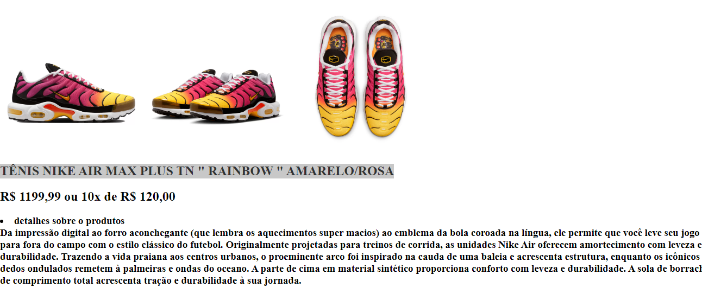

 git-produtos
<<<<<<< HEAD

# SITE DE PRODUTOS

# Tecnologias utilizadas
Eu utilizei nas aulas de fdw os comandos HTML e CSS

# Descrição do meu site
 Fizemos um site usando hmtl e css, o site que eu fiz e um site de vendas de tenis, os tenis que eu usei são TÊNIS IMIGRANTE NUVEM FURTA COR ESSENCIAL, TÊNIS NIKE AIR MAX PLUS TN " RAINBOW " AMARELO/ROSA, Nike SB Dunk Low. 

 # Funcionalidade 
 A funcionalidade do meu site e ajudar as pessoas que estão  buscando tenis pra comprar originais e de qualidades. 

=======
 um site de produtos sobre vendas de tenis, fiz meu site usando hmtl e css 
 <h1 align="center"> Descrição do meu site</h1>
 <h1>
fizemos um site usando hmtl e css, o site que eu fiz e um site de vendas de tenis, os tenis que eu usei são "nike tn, jordan 4, nike SB Dunk Low  
</h1>
>>>>>>> 0c5f96c6fbdfa1d4364542d7ea29139244fc96a0
